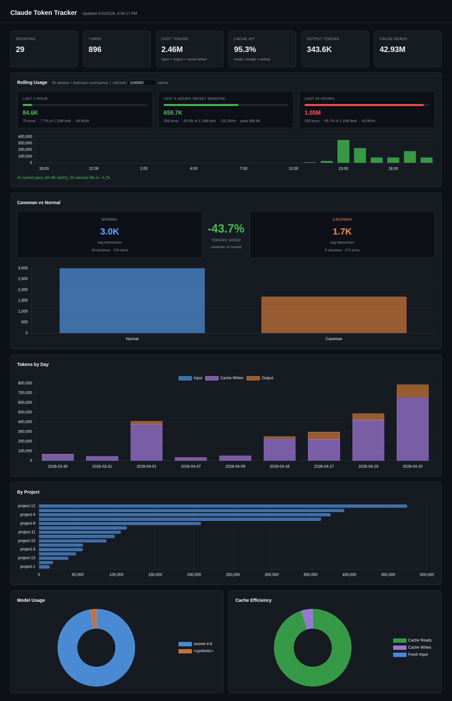

# Claude Token Tracker

Dashboard for tracking Claude Code token usage from local session data. Useful if you're on the $20/mo Claude Max plan and want visibility into how much you're consuming and when.



## What it tracks

- **Total usage** — sessions, turns, cost tokens, cache hit rate
- **Rolling windows** — 1h / 5h / 24h token usage with color-coded gauges (5h = Anthropic's reset window)
- **Burn rate** — tokens/hour with projection of when the 5h window fills
- **Caveman vs normal** — avg tokens/turn comparison when using the [caveman plugin](https://github.com/JuliusBrussee/caveman)
- **By day / by project** — usage breakdown over time
- **Model breakdown** — Sonnet vs Opus vs Haiku split
- **Cache efficiency** — reads vs writes vs fresh input

## How it works

Reads `~/.claude/projects/*/` — the JSONL session files Claude Code writes locally. No API calls, no external services. All data stays local.

## Usage

```bash
# 1. Parse session data → stats.json
python3 parser/parse.py

# Anonymize project names (useful for screenshots/sharing)
python3 parser/parse.py --anonymize

# 2. Serve dashboard (must run from project root)
python3 -m http.server 9420

# 3. Open
# http://localhost:9420/frontend/
```

## Soft limit

The dashboard has a configurable soft limit input (default: auto-calibrated from your historical peak 5h window + 10% headroom). Gauges go green → orange → red as you approach it.

Anthropic doesn't expose your actual quota, so this is an estimate. If you hit a real rate limit, note the 5h token count shown at that moment and set it as your limit.

## Requirements

Python 3.10+, no dependencies. Chart.js loaded from CDN.
